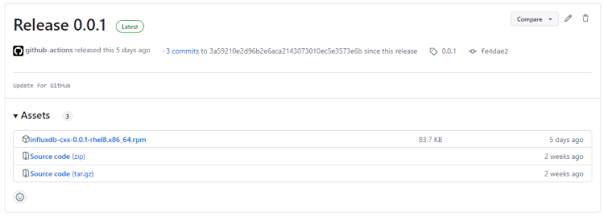
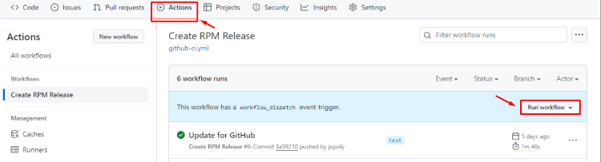

Usage of creating influxdb-cxx RPM packages
=====================================

This document is about how to create and publish rpm packages of influxdb-cxx to GitHub.

Environment for creating rpm of influxdb-cxx
=====================================
The description below is used in the specific Linux distribution RockyLinux8.
1. Docker
	- Install Docker
		```sh
		sudo yum install -y yum-utils
		sudo yum-config-manager --add-repo https://download.docker.com/linux/centos/docker-ce.repo
		sudo yum install -y docker-ce docker-ce-cli containerd.io
		sudo systemctl enable docker
		sudo systemctl start docker
		```
	- Enable the currently logged in user to use docker commands
		```sh
		sudo gpasswd -a $(whoami) docker
		sudo chgrp docker /var/run/docker.sock
		sudo systemctl restart docker
		```
	- Proxy settings (If your network must go through a proxy)
		```sh
		sudo mkdir -p /etc/systemd/system/docker.service.d
		sudo tee /etc/systemd/system/docker.service.d/http-proxy.conf << EOF
		[Service]
		Environment="HTTP_PROXY=http://proxy:port/"
		Environment="HTTPS_PROXY=http://proxy:port/"
		Environment="NO_PROXY=localhost,127.0.0.1"
		EOF
		sudo systemctl daemon-reload
		sudo systemctl restart docker
		```
2. rpm Tools
	- rpmdevtools
		```sh
		sudo yum install -y rpmdevtools
		```
	- rpm-build
		```sh
		sudo yum install -y gcc gcc-c++ make automake autoconf rpm-build
		```
3. Get the required files  
	```sh
	git clone https://github.com/pgspider/influxdb-cxx.git
	```

Creating influxdb-cxx rpm packages
=====================================
1. File used here
	- docker/influxdb-cxx.spec
	- docker/env_rpmbuild.conf
	- docker/Dockerfile_rpm
	- docker/create_rpm_binary.sh
2. Configure `docker/env_rpmbuild.conf` file
	- Configure proxy (optional)
		```sh
		proxy: The ip address of proxy server. 
		no_proxy: List of domains to exclude proxying.
		```
	- Configure the registry location to publish the package and version of the packages
		```sh
		ACCESS_TOKEN=						# Fill in the access token of your account. It will be used for authentication when publish docker image or packages to GitHub. Refer (https://docs.github.com/en/authentication/keeping-your-account-and-data-secure/managing-your-personal-access-tokens#creating-a-personal-access-token-classic) for how to create a access token.
		RPM_DISTRIBUTION_TYPE=				# The distribution operating system name. The default value is "rhel8".
		OWNER_GITHUB=						# Owner of this repository on Gihub (For example: https://github.com/pgspider/parquet_s3_fdw. The owner is pgspider).
		INFLUXDB_CXX_PACKAGE_VERSION=	# Base version of influxdb-cxx package registry
		INFLUXDB_CXX_RELEASE_VERSION=	# Version of influxdb-cxx rpm package
		INFLUXDB_CXX_RELEASE_ID=		# Before using shell script, you need to create a release (with a tag name) in GitHub manually. And then you need to access into [here](https://docs.github.com/en/graphql/overview/explorer) and execute the below script to get release id (need to update **owner**, **name** and **tagName**):
		```
		```sh
		{
			repository(owner: "pgspider", name: "influxdb-cxx") {
					release(tagName: "0.0.1") {
					databaseId
					createdAt
				}
			}
		}
		```
3. Build execution
	```sh
	chmod +x docker/create_rpm_binary.sh
	./docker/create_rpm_binary.sh
	```
4. Confirmation after finishing executing the script
	- Terminal displays a success message. 
		```
		{"message":"201 Created"}
		...
		{"message":"201 Created"}
		```
	- rpm Packages are stored on the assert of Release. For example:

		

Usage of GitHub Actions
=====================================
1. Configure `.github/workflows/github-ci.yml` file, update value of the below variable (refer to [this section](#creating-pgspider-rpm-packages)):
	- RPM_ARTIFACT_DIR
	- RPM_DISTRIBUTION_TYPE
	- INFLUXDB_CXX_RELEASE_VERSION

2. Access to Actions tab and click on Run workflow.

	
